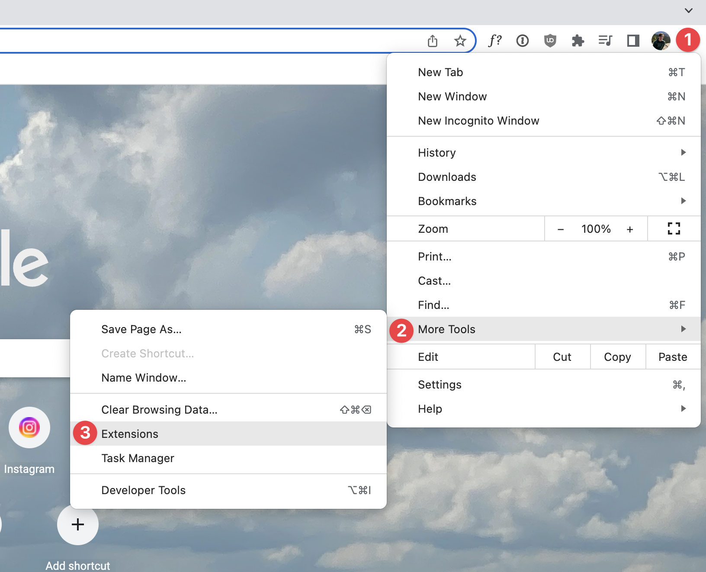
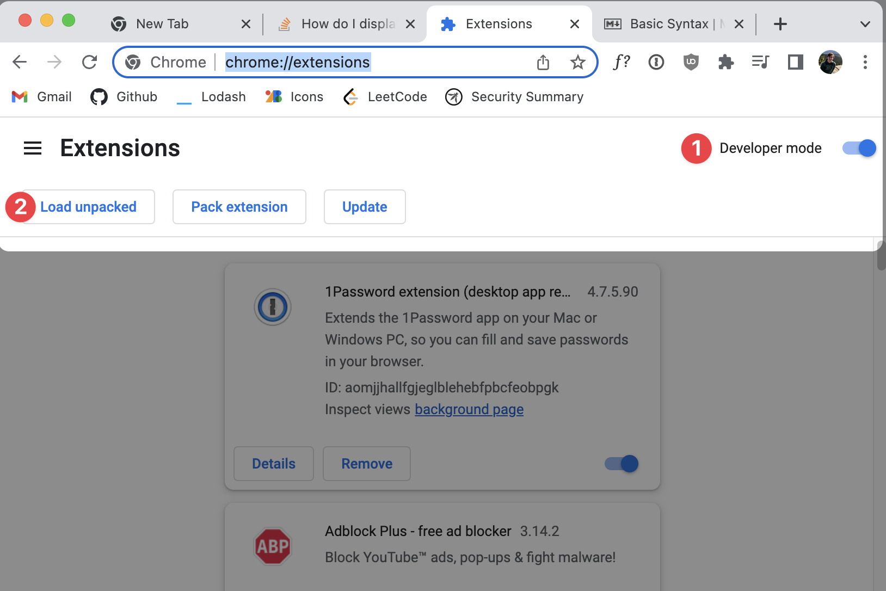
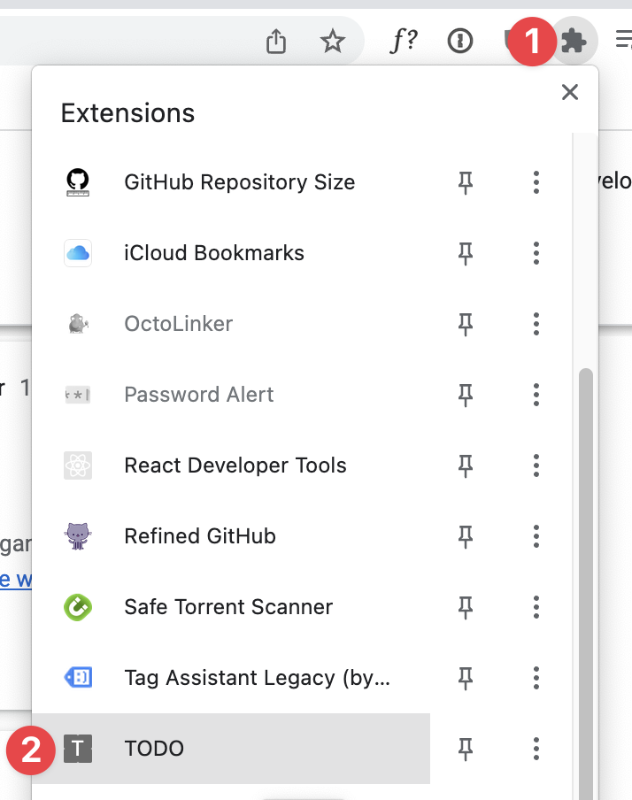

# Chrome Extension for Open AI

## How to Test Locally

1. Run the following to compile a prod /out folder

`npm i && npm run build`

2. Go To [Navigate to chrome://extensions/](chrome://extensions/)

3. Toggle on Developer mode and load the /out package

4. Pin and open the chrome extension

